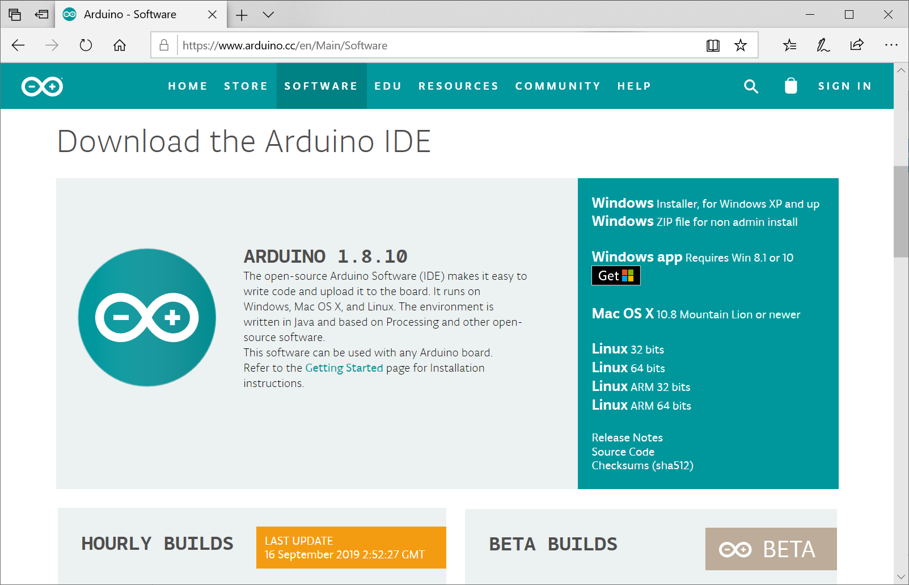
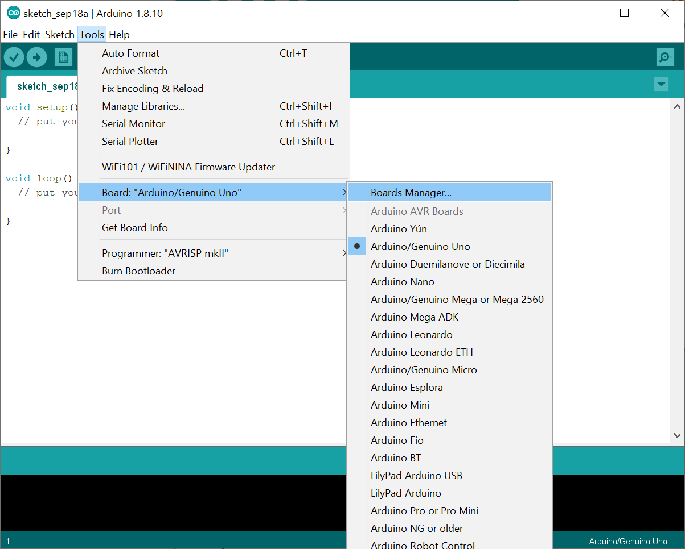
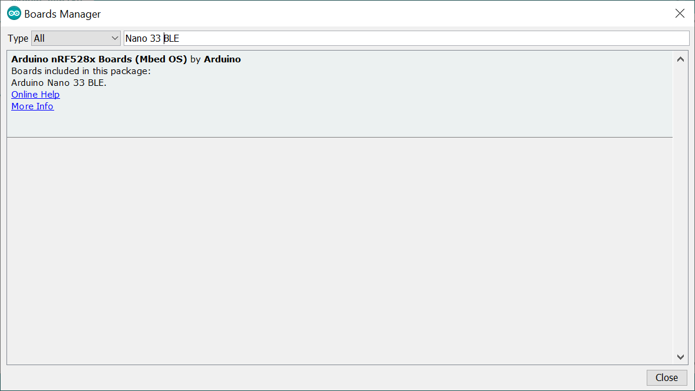
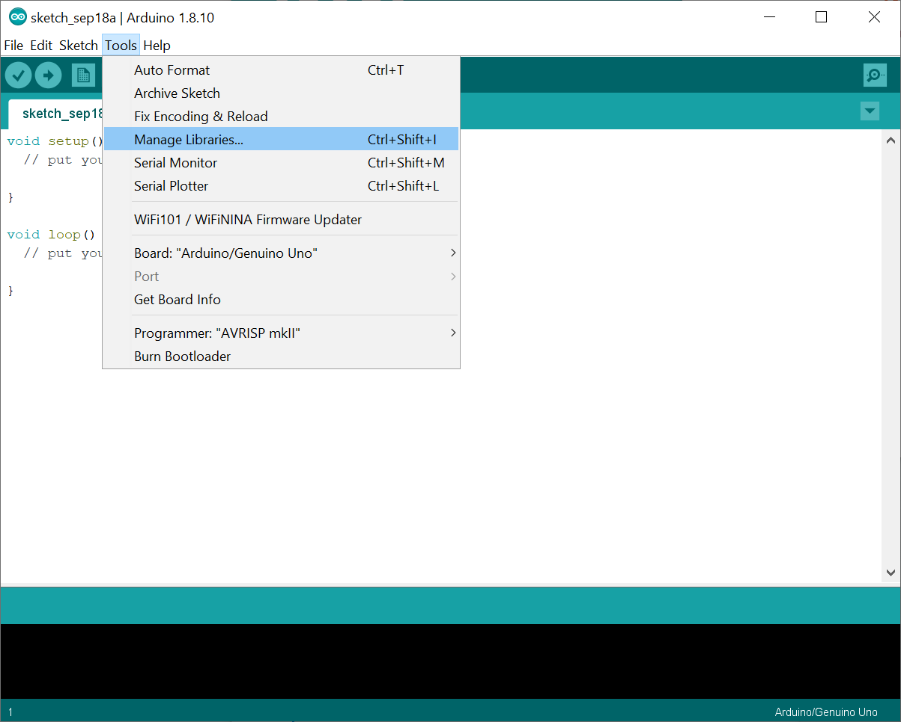
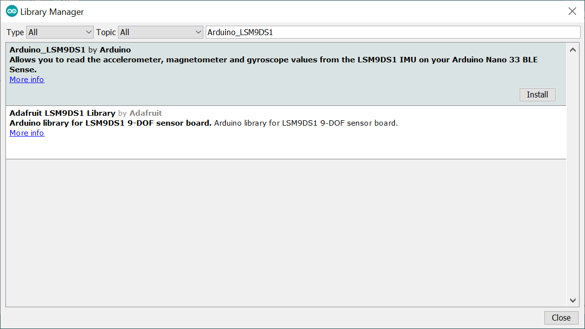

# Ejercicio 1 - Entorno de desarrollo

Vamos a configurar tu ordenador para desarrollar con Arduino.

## Arduino IDE
Arduino IDE es un entorno integrado de desarrollo (IDE) con licencia libre, disponible para múltiples plataformas como Windows, MacOSX o Linux. Arduino IDE nos permite escribir los programas de Arduino y cargarlos en la placa. d

Arduino IDE puede descargarse desde https://arduino.cc/downloads

        
### Añadir soporte para la placa Arduino Nano BLE 33 Sense
Arduino IDE por defecto soporta una serie de placas base. Para ampliar el soporte a otro tipo de placas, debemos instalar un fichero de definiciones. De esta forma Arduino IDE dispondrá de los parámetros adecuados para nuestro modelo.

Vamos a utilizar el Gestor de Tarjetas de Arduino para instalar la definición de la Arduino nRF528x, que es la compatible con nuestra placa. Para acceder al Gestor de Tarjetas utilizaremos el menu _Herramientas -> Placas: -> Gestor de tarjetas..._

En el cuadro de búsqueda indicaremos "Nano 33 BLE" e instalaremos las definiciones para Arduino nRF528x Boards (Mbed OS).

        
### Librerías adicionales Arduino Nano BLE 33 Sense
Arduino IDE permite incorporar una serie de librerías con código adicional, para ofrecer compatibilidad con dispositivos adicionales. Cuando queramos trabajar con un nuevo sensor, o unas funcionalidades extra, deberemos añadir estas librerías. Las librerías nos facilitarán enormemente la programación.

Debemos instalar las siguientes librerías para realizar los siguientes ejercicios. 

* TensorFlow Lite (buscar por "Arduino_TensorFlowLite")
* Arduino LSM9DS1 (buscar por "Arduino_LSM9DS1")

Para ello, utilizaremos el Gestor de Librerías disponible desde el menú _Herramientas -> Administrar Bibliotecas..._:

Buscaremos por "Arduino_TensorFlowLite". Pulsaremos sobre la fila y pulsaremos el botón __Instalar__ para instalar TensorFlow Lite for Microcontrollers

Buscaremos por "Arduino_LSM9DS1". Pulsaremos osbre la fila y pulsaremos el botón __Instalar__ para instalar la librería LSM9DS1 para el acelerometro, magnetometro y giróscopo que incluye nuestro Arduino.

Los __usuarios de Linux__ pueden tener que configurar los permisos para que su usuario pueda acceder al puerto serie. Para ello se puede seguir la [Guía de iniciación para Linux](https://www.arduino.cc/es/guide/linux) en el sitio web de Arduino para más información.

Próximo ejercicio: [Ejercicio 2: Conectando la placa](exercise2.md)
