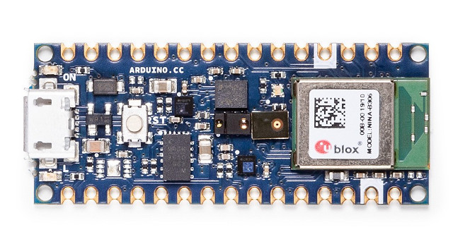
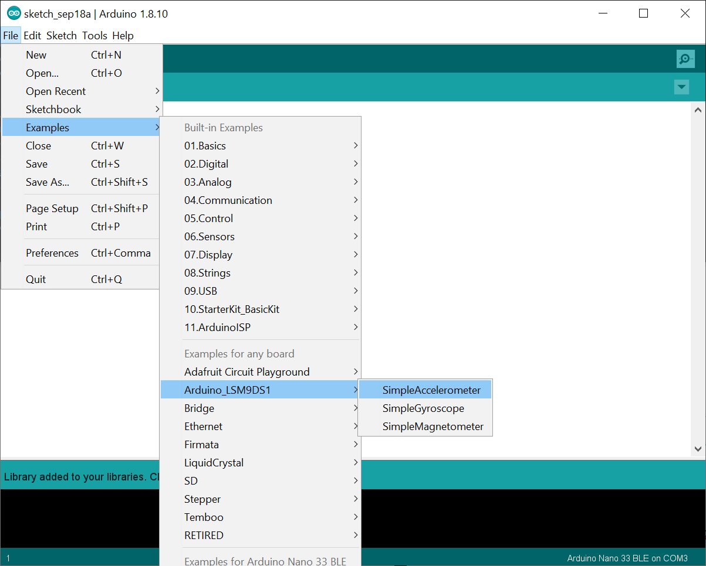
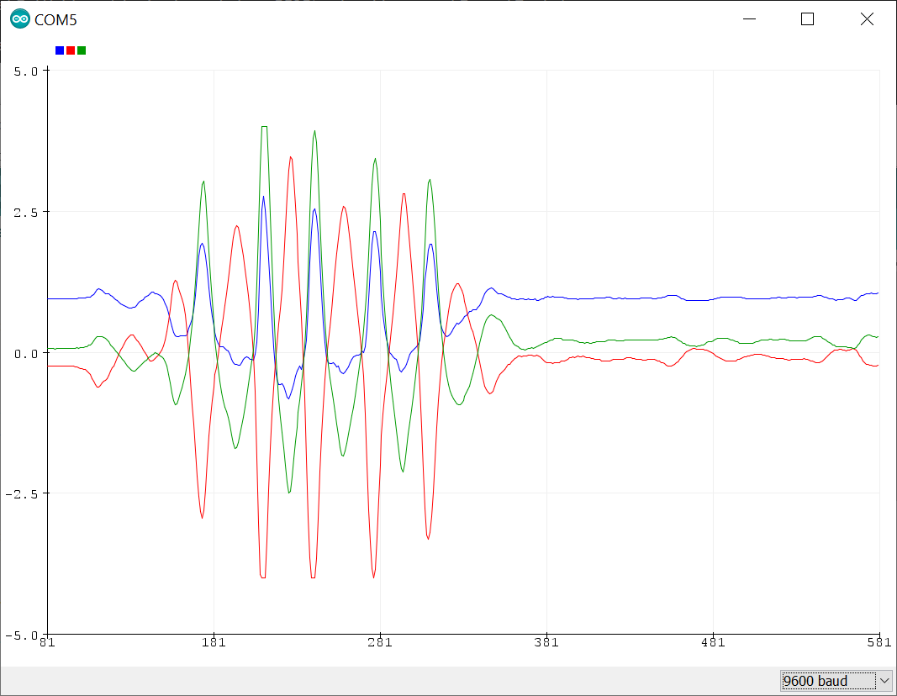

# Ejercicio 2: Conectando la placa

## Configuración inicial

1. Sacar la placa Arduino Nano 33 BLE Sense de la caja (no dejar la placa sobre la espuma que viene dentro de la caja, ya que es conductora)
2. Conectar el cable micro USB a uno de los puertos de tu ordenador
3. Abrir la aplicación Arduino IDE en tu ordenador
4. Seleccionar la placa `Herramientas -> Placa -> Arduino Nano 33 BLE`
5. Choose the port `Herramientas -> Puerto -> COM5 (Arduino Nano 33 BLE)` (Nota: el puerto puede tener otro nombre o formato diferente)

## Ejemplos LSM9DS1 (Opcional)

Puedes probar los programas de ejemplo que vienen incluidos con la librería LSM9DS1.

1. Abrimos el programa Simple Accelerometer desde el menú `Archivo -> Ejemplos -> Arduino_LSM9DS1 -> SimpleAccelerometer`
2. Subimos el programa a la placa utilizando el menú `Programa  -> Subir` o pulsando la flecha hacia la derecha en la barra de herramientas.
3. Abrimos el monitor serie en `Herramientas -> Monitor Seriel` para ver la salida en modo texto.
4. Abrimos el Serial Plotter `Herramietnas -> Serial Plotter` para ver la salida en módo gráfico.

Próximo ejercicio: [Ejercicio 3: Visualizar los datos de la IMU](exercise3.md)
