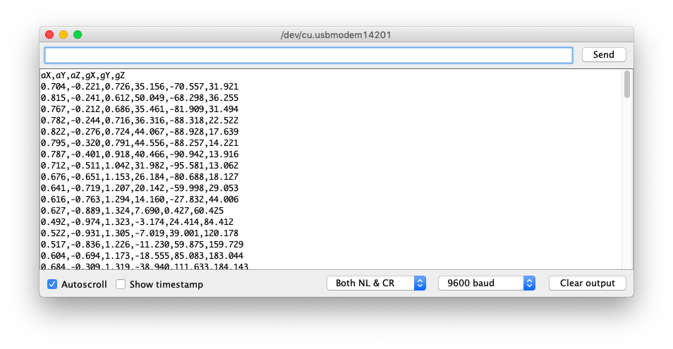
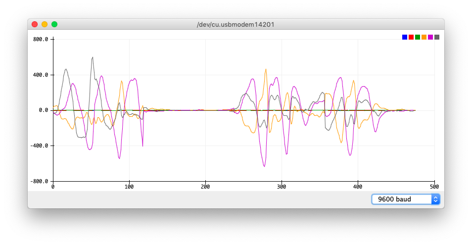

# Ejercicio 3: Visualizar los datos del IMU

1. Abrir el ejemplo __ArduinoSketches/IMU_Capture/IMU_Capture.ino__ desde Arduino IDE.
2. Compilar el programa y cargarlo en la placa desde: `Programa -> Subir`
3. Abrir el Monitor Serie: `Herramientas -> Monitor Serie`
4. Pulsar el botón, los datos del la IMU serán capturados y enviados durante 1 segundo.
5. Cerrar la ventana del Monitor Serie.
6. Abrir el Serial Plotter: `Herramientas -> Serial Plotter`
7. Presionar el botón y realizar un gesto.
8. Observar en la pantalla el gráfico con los datos de la captura.
9. Repetir capturando varios gestos para hacernos una idea de cómo serán los datos de entrenamiento
10. Cerrar el Serial Plotter

Próximo ejercicio: [Ejercicio 4: Recopilando los datos para el entrenamiento](exercise4.md)
