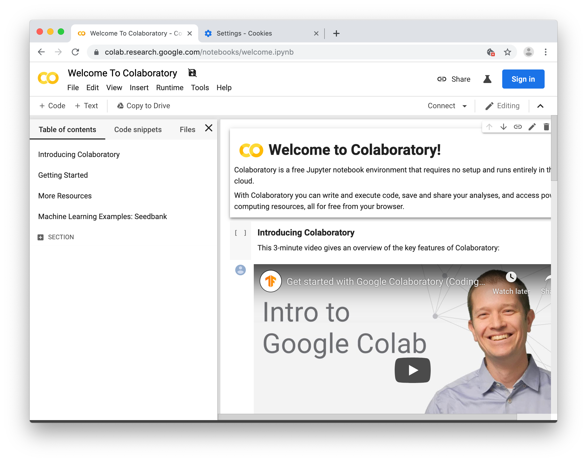
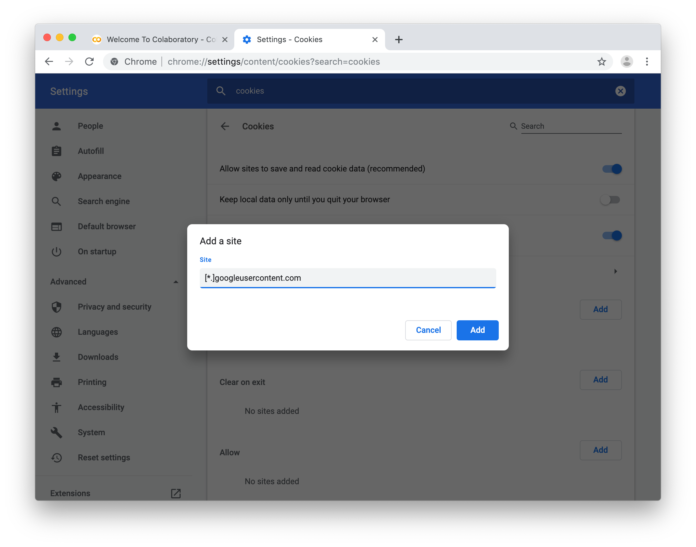

# Ejercicio 5: Aprendizaje máquina

Vamos a utilizar [Google Colab](https://colab.research.google.com) para entrenar nuestro modelo de aprendizaje máquina. Colab nos permite utilizar un cuaderno Jupyter desde el navegador web para ejecutar el proceso de aprendizaje máquina.

## Cookies de terceros

Algunos podeis encotnrar un error sobre cookies de terceros.

Puedes habilitar las cookies de terceros, o mejor aún, añadir una excepción para `[*.]googleusercontent.com`.

## Abrir el cuaderno

Abrir el cuaderno en Colab.

https://colab.research.google.com/github/elsatch/ArduinoTensorFlowLiteTutorials/blob/master/GestosAEmoji/arduino_tinyml_workshop.ipynb

Próximo ejercicio: [Ejercicio 6: Clasificando los datos de la IMU](exercise6.md)
