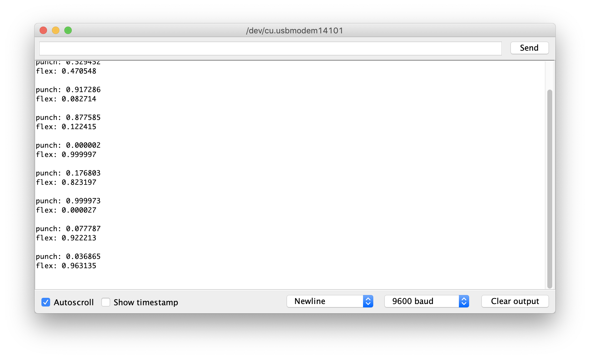

# Clasificando los datos de la IMU

1. Abrir __ArduinoSketches/IMU_Classifier/IMU_Classifier.ino__ en el Arduino IDE.
2. Seleccionar la pestaña model.h
3. Reemplazar los contenidos de model.h con la versión descargada desde Colab
4. Subir el programa: `Programa -> Subir`
5. Abrir el monitor serie: `Herramientas -> Monitor Serie`
6. Presionar el botoón y realizar un gesto de los que hemos entrenado
7. El grado de confianza para cada gesto aparecerá impreso en el monitor serie (0 -> bajo grado de confianza, 1 -> alto grado de confianza)

Próximo ejercicio: [Ejercicio 7: Teclado de emojis controlado por USB](exercise7.md)
